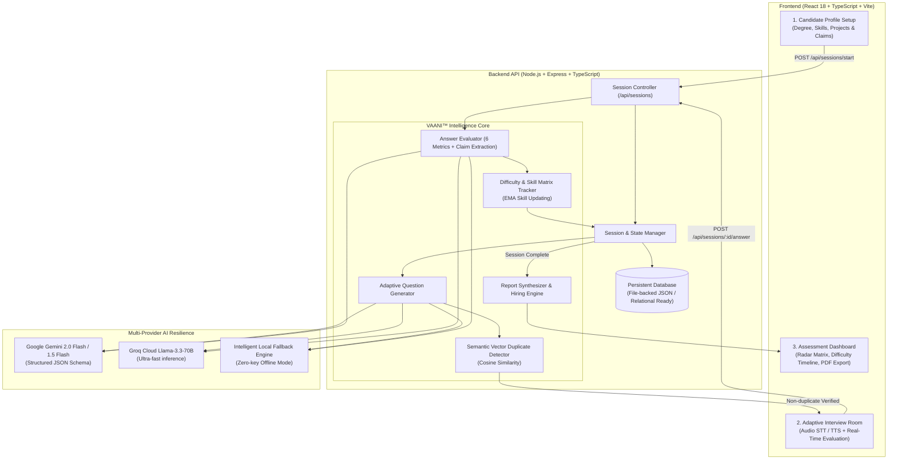

# VAANI™ — Adaptive AI Interview & Assessment Intelligence

[](https://nodejs.org/)
[](https://react.dev/)
[](https://www.typescriptlang.org/)
[](https://tailwindcss.com/)
[](https://opensource.org/licenses/MIT)

> **MetaDamen Internship AI Application Assignment**  
> **Candidate Track:** Associate Software Engineer / AI-ML  
> **Author Submission:** Complete Production Prototype & Documentation

---

## 1. Product Overview

**VAANI™** (Voice & Adaptive Assessment Network Intelligence) is an AI-powered technical and behavioral interview platform. Unlike traditional static chatbots that follow hardcoded question trees, VAANI™ acts as a hiring interviewer:

1. **Context-Aware Question Generation**: Ingests candidate degree, target company, role, declared skills, and specific project claims.
2. **Multi-Dimensional Answer Evaluation**: Evaluates every candidate response across **6 discrete dimensions** (*Technical Accuracy, Depth, Communication, Relevance, Clarity, and Overall Score*).
3. **Adaptive Difficulty Engine**: Scales difficulty (*Easy $\leftrightarrow$ Medium $\leftrightarrow$ Hard*) dynamically based on real-time candidate performance.
4. **Project Claim Verification**: Detects specific technical claims (*e.g., "achieved 95% model accuracy", "sub-20ms latency"*) and aggressively probes validation methodologies, data leakage, and system trade-offs.
5. **Semantic Duplicate Detection**: Employs vector cosine similarity to ensure candidates are never asked redundant or paraphrased questions.
7. **Animated AI Recruiter Avatar & Studio Neural Speech**: VAANI™ physically speaks every question aloud using studio-grade 24kHz Microsoft Azure Neural Voices with real-time audio-reactive lip-syncing, eye blinks, frequency visualizers, and customizable voice accents (Ava, Andrew, Jenny, Neerja).
8. **Continuous Speech Recognition**: Integrated persistent microphone Speech-to-Text (STT) for candidates to speak their answers naturally without timeout cutoffs.

---

## 2. Technical Architecture



---

## 3. Technology Choices & Justification

| Technology | Selected | Justification |
| :--- | :--- | :--- |
| **Backend Runtime** | **Node.js (v18+)** | High-performance asynchronous I/O, native JSON handling, rich ecosystem, and requested by the project requirements. |
| **API Framework** | **Express + TypeScript** | Strict compile-time typing, maintainable routing, and clear separation of concerns. |
| **Validation Layer** | **Zod** | Enforces strict runtime JSON schema validation on all LLM outputs to guarantee zero runtime crashes (Section 17). |
| **Semantic Similarity** | **Cosine Similarity Vector Engine** | Computes normalized vector dot products over token frequency spaces for lightning-fast ($<5\text{ms}$) duplicate detection without requiring paid external vector subscriptions. |
| **Frontend Framework** | **React 18 + Vite** | Instant Hot Module Replacement (HMR), lightweight bundle size, and fast client-side routing. |
| **Styling & Icons** | **Tailwind CSS + Lucide Icons** | Polished dark-mode recruitment intelligence theme with modern typography and animations. |
| **Data Visualization** | **Recharts** | Real-time competency radar matrix and difficulty progression timeline. |
| **Database** | **Neon Serverless PostgreSQL (Hybrid Relational + JSONB)** | Cloud-native serverless PostgreSQL with indexed JSONB schema for nested AI evaluations and reports. Powered by `@neondatabase/serverless` for instant cold-starts on Vercel, with automatic local fallback. |

---

## 4. Does this Project Need RAG and a Vector Database?

### The Architectural Verdict:
> **Traditional document RAG (e.g. Pinecone/Milvus enterprise cluster) is NOT required, but Vector Embeddings & Cosine Similarity ARE essential for Section 12 (Semantic Duplicate Detection) and Claim Verification.**

1. **Why Enterprise Document-RAG is Redundant Here:**
   - Document RAG retrieves static text chunks from external company manuals.
   - In a technical interview, the LLM evaluates foundational computer science, system design, and algorithms. Constraining the interview to a static question bank harms the dynamic adaptability required by Section 7.
2. **Where Vector Similarity is Vital (Section 12):**
   - The engine generates original questions. To prevent asking semantic variations of the same concept (e.g. *"Explain overfitting in ML"* vs *"How do you prevent a model from memorizing training data?"*), VAANI™ vectorizes incoming questions and computes cosine similarity against all previously asked questions in the session.
   - **Threshold Logic**:
     - $\text{Similarity} \ge 0.82$: **Semantic Duplicate** $\rightarrow$ Automatically discarded; the engine re-prompts for an alternate angle.
     - $0.52 \le \text{Similarity} < 0.82$: **Distinct aspect of the same skill** $\rightarrow$ Permitted.
     - $\text{Similarity} < 0.52$: **Distinct topic** $\rightarrow$ Permitted.

---

## 5. Free LLMs for Testing & Evaluation

VAANI™ implements a multi-provider fallback architecture:
1. **Google Gemini 2.0 Flash / 1.5 Flash (Recommended)**:
   - **Cost**: 100% Free via [Google AI Studio](https://aistudio.google.com/).
   - **Rate Limit**: 15 Requests Per Minute (RPM), 1,500 requests per day for free.
   - **Features**: Native JSON Schema validation mode (`responseMimeType: "application/json"`).
2. **Groq Cloud (`llama-3.3-70b-versatile`)**:
   - **Cost**: 100% Free tier at [console.groq.com](https://console.groq.com/).
   - **Speed**: $300 - 500\text{ tokens/sec}$ with ultra-low latency.
3. **Local Fallback Simulator (Zero-Key Evaluation)**:
   - Built directly into the backend. If no API key is provided, the backend seamlessly runs dynamic heuristic evaluation so reviewers can test the application immediately without signing up for any API!

---

## 6. Core Features & Requirement Mapping

### A. Candidate Profiling (Section 5)
Captures Name, Degree, Branch, Year, Target Company, Target Role, Technical Skills, Projects, and Internship Experience. Includes a **"⚡ Load MetaDamen Scenario"** button to instantly populate the assignment's reference scenario (3rd-Year B.Tech CSE / AI-ML student targeting Associate Software Engineer at MetaDamen).

### B. Adaptive Interview Engine (Section 6 & 7)
Conducts a 5-stage dynamic interview:
1. **Introduction**: Candidate background, motivation, and career alignment.
2. **Technical Assessment**: In-depth questions based on declared skills.
3. **Project Deep Dive (Claim Verification)**: Probes project architecture and technical claims.
4. **Problem Solving**: Production debugging, latency diagnosis, and system trade-offs.
5. **Behavioral / HR**: Technical conflict resolution and engineering ownership.

### C. Multi-Metric Answer Evaluation (Section 8)
Evaluates every candidate answer across:
- `overallScore` (1–10)
- `technicalAccuracy` (1–10)
- `communication` (1–10)
- `relevance` (1–10)
- `clarity` (1–10)
- `depth` (1–10)
- `strengths` (array of specific positive highlights)
- `weaknesses` (array of technical gaps)
- `followUpRequired` (boolean)
- `extractedClaims` (array of identified quantifiable claims)

### D. Adaptive Difficulty Progression (Section 9)
- **Strong Performance ($\text{Score} \ge 7$)**: $\text{Easy} \rightarrow \text{Medium} \rightarrow \text{Hard}$
- **Weak Performance ($\text{Score} < 5$)**: $\text{Hard} \rightarrow \text{Medium} \rightarrow \text{Easy}$
- **Skill Profile Evolution**: Real-time candidate skill ratings evolve using exponential moving averages.

### E. Project Claim Verification (Section 10)
Identifies technical claims in projects and answers (e.g. *"95% model accuracy"*). VAANI™ asks targeted follow-up questions probing train-test splits, data leakage prevention, class imbalance handling, and validation metrics.

### F. Semantic Duplicate Detection (Section 12)
Computes mathematical cosine similarity over normalized term vectors with automatic regeneration when similarity exceeds the $0.82$ threshold.

### G. Comprehensive Assessment Dossier & Dashboard (Sections 13 & 14)
- **Score Breakdown**: Technical Knowledge, Problem Solving, Communication, Project Understanding, Behavioral, and Overall Readiness.
- **Competency Radar Matrix**: Polygon visualization of skills.
- **Adaptive Difficulty Progression**: Line chart tracking score and difficulty over time.
- **Algorithmic Recommendation**: Computes *"Strong Candidate"*, *"Placement Ready"*, *"Developing"*, or *"Needs Improvement"* derived from assessment data.
- **Dossier Export**: Export assessment reports as formatted JSON or print to PDF.

---

## 7. Quickstart Guide (Local Setup)

### Prerequisites:
- **Node.js**: v18.0.0 or higher
- **npm**: v9.0.0 or higher

### Step 1: Clone the Repository
```bash
git clone https://github.com/your-username/vaani-interview-intelligence.git
cd vaani-interview-intelligence
```

### Step 2: Install Dependencies
Install all backend and frontend dependencies:
```bash
npm run install:all
```

### Step 3: (Optional) Configure AI Keys
The application works immediately in **Local Mock Fallback Mode** without any API keys.  
To connect live Google Gemini or Groq models, edit `backend/.env`:
```env
PORT=5000
AI_PROVIDER=gemini
GEMINI_API_KEY=your_free_gemini_api_key_here
GEMINI_MODEL=gemini-2.0-flash
```
*(Get a 100% free Gemini API key in 1 click at [aistudio.google.com](https://aistudio.google.com/))*

### Step 4: Run the Application
Run both backend and frontend concurrently with a single command:
```bash
npm run dev
```

- **Frontend Application**: `http://localhost:3000`
- **Backend API**: `http://localhost:5000`
- **API Health Check**: `http://localhost:5000/api/health`

---

## 8. Demo Video Script & Submission Guide

A 5-7 minute demonstration guide and storyboard is included in:  
👉 **[docs/DEMO_VIDEO_GUIDE.md](docs/DEMO_VIDEO_GUIDE.md)**

### Key Demo Highlights:
1. Load Candidate Scenario with 1 click.
2. Demonstrate VAANI's Text-to-Speech interviewer voice and Speech-to-Text audio response.
3. Show real-time answer evaluation and skill score bar updates.
4. Demonstrate Difficulty Adaptation ($\text{Medium} \rightarrow \text{Hard}$).
5. Show Project Claim Verification probing the "95% accuracy" claim.
6. Review the Final Assessment Report, Radar Matrix, and Dossier Export.

---

## 9. Project Directory Structure

```
vaani-interview-intelligence/
├── backend/
│   ├── src/
│   │   ├── ai/
│   │   │   ├── duplicateDetector.ts   # Vector cosine similarity duplicate engine
│   │   │   ├── llmProvider.ts         # Gemini / Groq / Mock multi-provider abstraction
│   │   │   └── prompts.ts             # Adaptive prompts with strict JSON schema enforcement
│   │   ├── config/
│   │   │   └── env.ts                 # Environment configuration
│   │   ├── db/
│   │   │   └── database.ts            # Persistent session database
│   │   ├── routes/
│   │   │   └── sessionRoutes.ts       # REST endpoints for interview lifecycle
│   │   ├── services/
│   │   │   └── adaptiveEngine.ts      # Adaptive stage, difficulty & skill logic
│   │   ├── types/
│   │   │   └── index.ts               # Zod validation schemas and TypeScript types
│   │   ├── app.ts                     # Express application setup
│   │   └── server.ts                  # Server entry point
│   ├── .env.example
│   ├── package.json
│   └── tsconfig.json
├── frontend/
│   ├── src/
│   │   ├── components/
│   │   │   ├── AssessmentDashboard.tsx # Radar matrix, timeline, exportable dossier
│   │   │   ├── CandidateProfileForm.tsx# Candidate profile setup with 1-click scenario loader
│   │   │   ├── LiveInterviewRoom.tsx   # Live room with STT speech input and TTS voice
│   │   │   ├── Navbar.tsx              # Brand navigation & status indicator
│   │   │   └── SessionHistory.tsx      # Past interviews archive
│   │   ├── services/
│   │   │   └── api.ts                  # Frontend API client
│   │   ├── types/
│   │   │   └── index.ts                # Client-side TypeScript interfaces
│   │   ├── App.tsx                     # Main layout & interview state coordinator
│   │   ├── main.tsx                    # React DOM root
│   │   └── index.css                   # Tailwind styles & typography
│   ├── index.html
│   ├── package.json
│   ├── tsconfig.json
│   ├── vite.config.ts
│   └── tailwind.config.js
├── docs/
│   ├── ARCHITECTURE.md                 # Deep architectural specifications & formulas
│   ├── API_SPEC.md                     # Complete REST API reference
│   └── DEMO_VIDEO_GUIDE.md             # 5–7 minute video recording walkthrough
├── start.js                            # Cross-platform concurrent runner
├── .gitignore
├── package.json
└── README.md
```

---

## 10. Limitations & Future Roadmap

1. **Facial Expression & Confidence Analysis**: Future iterations could integrate computer vision (e.g. MediaPipe / WebRTC) to evaluate non-verbal communication and eye contact.
2. **Interactive Coding Sandbox**: Integrate Monaco Editor or WebContainers to execute live code in Python, JavaScript, and SQL in the browser.
3. **Enterprise ATS Integration**: Direct webhook sync with Greenhouse, Lever, and Workday.

---

## License
Distributed under the MIT License. Developed for the MetaDamen AI Application Internship Assignment.
