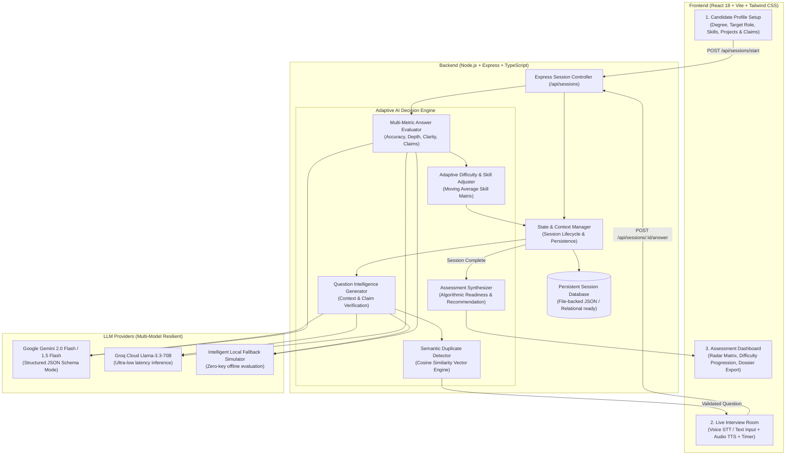

# VAANI™ System Architecture & Technical Specifications

> **Adaptive AI Interview & Assessment Intelligence**  
> Developed for the **MetaDamen Internship AI Application Assignment**

---

## 1. System Overview

VAANI™ is an adaptive AI-powered interview and assessment system that evaluates engineering candidates through dynamic conversational reasoning. Unlike standard LLM chatbots that follow a static script, VAANI™ maintains internal state, evaluates candidates across 6 discrete scoring dimensions on every turn, verifies technical resume claims, scales question difficulty dynamically, and produces an algorithmic final hiring recommendation.



---

## 2. Dynamic Adaptive State Machine

The interview does **not** follow a fixed question sequence. The dynamic engine adapts based on candidate performance:

### Stage Progression:
1. **Introduction**: Evaluates communication, background alignment, and motivation for the target role.
2. **Technical Assessment (Primary Skill)**: Tests declared skills (e.g. Python, SQL, ML) at initial baseline difficulty.
3. **Adaptive Branching**:
   - If performance $\ge 7/10$: Progresses directly to deeper optimization, concurrency, or claims.
   - If performance $< 5/10$: Pivots to core foundational concepts.
4. **Project Deep Dive & Claim Verification**:
   - The engine parses projects and answers for quantifiable claims (e.g. *"Achieved 95% model accuracy"*, *"sub-20ms latency"*).
   - Probes the candidate on dataset splits, data leakage prevention, edge cases, and architectural trade-offs.
5. **Problem Solving & Systems**:
   - Practical debugging scenarios, latency diagnosis, and algorithmic trade-offs.
6. **Behavioral / Engineering Culture**:
   - Technical disagreements, failure recovery, teamwork, and accountability.

---

## 3. Dynamic Difficulty Scaling Logic (Section 9)

Candidate difficulty scales after each response:
- **Strong Response ($\text{Score} \ge 7$)**: $\text{Easy} \rightarrow \text{Medium} \rightarrow \text{Hard}$
- **Weak Response ($\text{Score} < 5$)**: $\text{Hard} \rightarrow \text{Medium} \rightarrow \text{Easy}$
- **Intermediate Response ($5 \le \text{Score} \le 6$)**: Maintains current difficulty and probes adjacent technical angle.

### Skill Profile Evolution:
Candidate skill scores are updated on every turn using an Exponential Moving Average (EMA):
$$\text{Skill}_{\text{new}} = \text{round}\left(\text{Skill}_{\text{old}} \times 0.55 + \text{Score}_{\text{new}} \times 0.45\right)$$
Communication score is updated across all responses:
$$\text{Comm}_{\text{new}} = \text{round}\left(\text{Comm}_{\text{old}} \times 0.60 + \text{Comm}_{\text{turn}} \times 0.40\right)$$

---

## 4. Semantic Duplicate Detection & Cosine Similarity (Section 12)

### The Problem:
An interview system must avoid repeatedly asking questions that probe the same concept with slight rephrasings (e.g., *"Explain overfitting in ML"* vs *"How do you prevent a model from memorizing training data?"*).

### The Mathematical Approach:
1. **Normalization & Vectorization**: Questions are normalized, punctuation stripped, and mapped into term frequency vector spaces:
   $$\mathbf{u} = \text{vec}(Q_1), \quad \mathbf{v} = \text{vec}(Q_2)$$
2. **Cosine Similarity**:
   $$\cos(\theta) = \frac{\mathbf{u} \cdot \mathbf{v}}{\|\mathbf{u}\|_2 \|\mathbf{v}\|_2} = \frac{\sum_{i} u_i v_i}{\sqrt{\sum_{i} u_i^2} \sqrt{\sum_{i} v_i^2}}$$
3. **Threshold Calibration**:
   - **$\text{Similarity} \ge 0.82$ (Semantic Duplicate)**: Rejected! The question generation loop automatically regenerates with an alternate subtopic.
   - **$0.52 \le \text{Similarity} < 0.82$ (Distinct Aspect / Related Domain)**: Permitted! (e.g. testing Data Leakage vs Hyperparameter Tuning in ML).
   - **$\text{Similarity} < 0.52$ (Distinct Topic)**: Permitted.

---

## 5. Structured AI Responses & Resilient Validation (Section 17)

Every LLM generation passes through strict **Zod** schema parsing:
- Strips markdown code blocks (` ```json ... ``` `).
- Validates all required fields, numerical bounds, and array lengths.
- If the external API times out or exceeds rate limits, the system seamlessly activates the **Intelligent Local Fallback Engine**, ensuring the interview continues with zero crashes or blank screens.
